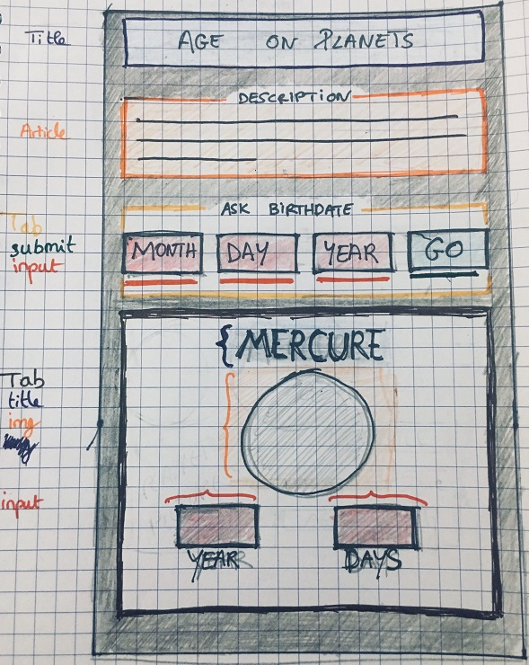

# CALCUL DE MON AGE SUR LES PLANÈTES

## CONSIGNES

Créer un nouveau projet d'une page (mobile first) qui propose à l'utilisateur de rentrer sa date de naissance pour lui afficher, selon les différentes planètes du Système Solaire, et donc selon leur propre temps de révolution autour du Soleil, son âge sur toutes les dites planètes (+Pluton).

Utilisation du HTML, CSS et Javascript !

## ORGANISATION

Création du projet et des backlogs via TRELLO (méthode agile) :

  * Recherches sur la méthode Timestamp -> création fichier gists
  * Réalisation d'un algorithme papier et d'une maquette papier
  * Création de la structure des dossiers, des fichiers, du readme
  * Recherche + stockage des images à utiliser dans le dossier img
  * On applique l'algorithme avec le code
  * On applique la maquette avec le CSS
  * Et sutout, on push sur github régulièrement

  * on oublie pas la gh-page ;)

## MAQUETTE 

